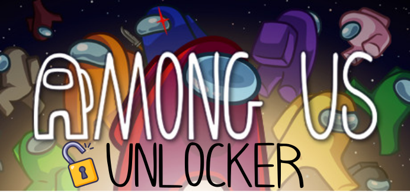

  

  
  
  

<b>Simple Among Us Mod that unlocks all cosmetics</b>

## 🎉 Features
**Unlock:**
- Hats
- Visors
- Skins
- Pets
- Nameplates
- Cosmicubes
- Bundles
- Free chat
- Friend list
- Custom name
- Online gameplay
- Remove minor status

## 🔥 Releases
AUnlocker is compatible with PC / desktop Among Us. This includes Steam, Epic Games and itch.io.

The table below lists the most recent AUnlocker release for each Among Us version. Patch notes can be seen under each new [release](https://github.com/kk-dev7/AUnlocker/releases).

| Among Us Version | AUnlocker Version |
|:-:|:-:|
| `2023.10.24`       | v1.1 [(Download)](https://github.com/kk-dev7/AUnlocker/releases/tag/v1.1) |

Older versions of Among Us may or may not work. If you want to use AUnlocker with an older version, follow the steps [here](https://github.com/kk-dev7/AUnlocker#%EF%B8%8F-build).

## 💾 Installation
Download the latest release of AUnlocker [here](https://github.com/kk-dev7/AUnlocker/releases) and follow the instructions.

## 👷‍♂️ Build
You can build AUnlocker yourself by following these steps:
- Run the command "dotnet build" from the folder `AUnlocker/source` where the `csproj.` and the `AUnlockerPlugin.cs` files are located
- If you get any errors when building, feel free to open a new issue
- The compiled mod dll will be located here: `AUnlocker/source/bin/Debug/net6.0/AUnlocker.dll`

## 🎓 Contributing
- Found a bug? Want to suggest a new feature? Feel free to open a new issue [here](https://github.com/kk-dev7/AUnlocker/issues/new)!
- [Here](https://docs.github.com/en/get-started/quickstart/contributing-to-projects) is a great guide if you want to contribute to this project. 
- For making your own Among Us Mod, please refer to the [Reactor Docs](https://docs.reactor.gg)

If you want to use AUnlocker with an older Among Us version, make sure to change this: \
`<PackageReference Include="AmongUs.GameLibs.Steam" Version="2023.10.24" PrivateAssets="all" />` in `AUnlocker.csproj` to this: \
`<PackageReference Include="AmongUs.GameLibs.Steam" Version="YOUR_DESIRED_VERSION_HERE" PrivateAssets="all" />` before building.

## ⚠️ Disclaimer
This mod is not affiliated with Among Us or Innersloth LLC, and the content contained therein is not endorsed or otherwise sponsored by Innersloth LLC. Portions of the materials contained herein are property of Innersloth LLC. © Innersloth LLC.

This mod does not unlock all cosmetics **permanently**, so it does **not** add them to your account. This is because your progress is stored on the Innersloth servers and we cannot just modify it. However, this mod uses BepInEx and the Reactor Framework to Postfix Among Us game methods and unlock all cosmetics **temporarily**. If you uninstall this mod, the cosmetics will be locked again. The cosmetics you have already unlocked legitimately, e.g. through buying a cosmicube, are **untouched** by this mod.
